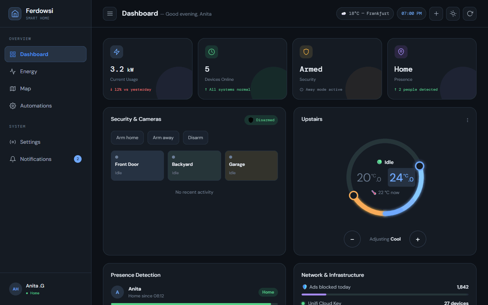
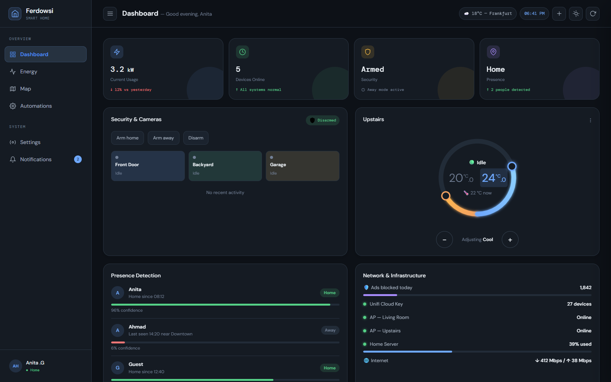
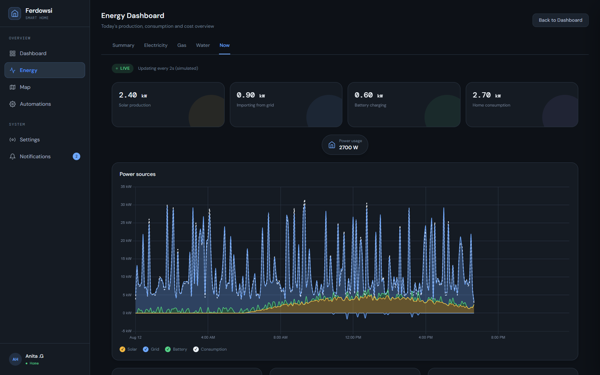
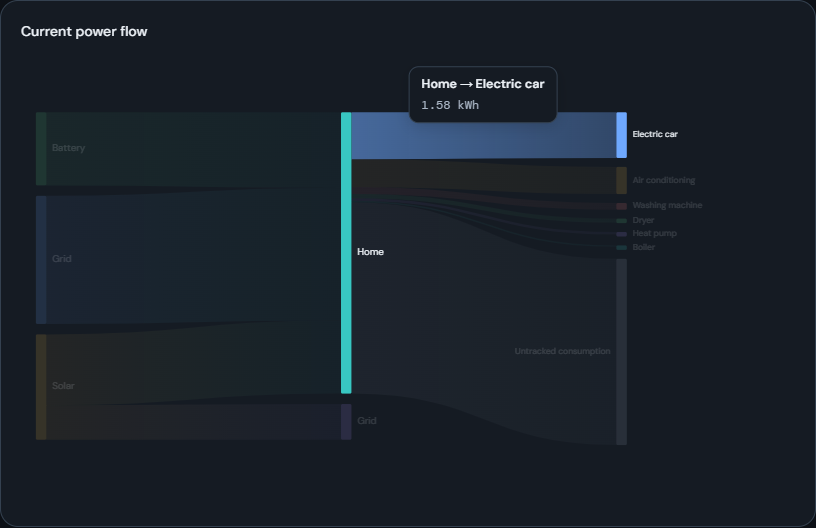
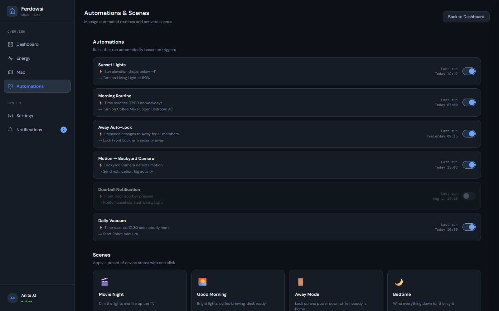

# Ferdowsi — Smart Home Dashboard

A front-end smart home dashboard built with React and Vite. It's a fully client-side demo/prototype — all data is simulated or seeded locally (with `localStorage` persistence), so it runs with no backend, API keys, or real devices required.



## Screenshots

| Dashboard | Live energy monitoring |
|---|---|
|  |  |

| Power flow (hover-to-highlight) | Automations |
|---|---|
|  |  |

## Features

- **Dashboard** — live-editable device grid, room cards with per-device on/off toggles, security status, presence detection, network status, energy distribution overview, an interactive floor plan, and a draggable dual-setpoint thermostat.
- **Energy** — Summary / Electricity / Gas / Water tabs with Chart.js charts, a "Current power flow" Sankey-style diagram (hover to highlight a single flow, dims everything else), and a **Now** tab with a simulated live power feed: a full-day power-sources chart, live gauges (battery charge, self-sufficiency, grid dependency), and a live power-flow diagram.
- **Map** — Leaflet map showing home zone and family member locations.
- **Automations** — automation rules and scene activation.
- **Notifications** — a real notification center (not just toasts): every meaningful change in the app (device toggles, thermostat setpoints, room devices) is recorded as a persistent notification, viewable and dismissible from the bell icon.
- **Activity log** — a full log combining seeded activity history with live notifications.
- **Settings / Profile** — theme (light/dark), localization (timezone, number/date/time format, first day of week), and a Home-Assistant-style settings landing page.
- Responsive layout, light/dark theme, toast notifications, and route-level code splitting for fast initial load.

## Tech stack

- [React 19](https://react.dev/) + [React Router 7](https://reactrouter.com/)
- [Vite](https://vite.dev/) (build tool, using the Rolldown-powered `vite` package)
- [Chart.js](https://www.chartjs.org/) / [react-chartjs-2](https://react-chartjs-2.js.org/) for charts
- [Leaflet](https://leafletjs.com/) / [react-leaflet](https://react-leaflet.js.org/) for the map
- Plain CSS (no framework/UI kit) — theme via CSS custom properties
- [Oxlint](https://oxc.rs/docs/guide/usage/linter) for linting

## Getting started

```bash
npm install
npm run dev       # start the dev server (http://localhost:5173)
npm run build     # production build to dist/
npm run preview   # preview the production build locally
npm run lint       # run Oxlint
```

Requires Node.js 18+.

## Project structure

```
src/
├─ components/     # Reusable UI: cards, modals, charts, the thermostat dial, etc.
├─ pages/          # One component per route (Dashboard, Energy, Map, Automations, Profile, Settings)
├─ layout/          # App shell: sidebar + top-level layout/outlet
├─ hooks/           # State + behavior: managed devices, notifications, live power simulation, theme, localization, etc.
├─ data/            # Seed/mock data (devices, rooms, energy, automations, security, notifications...)
├─ styles/          # Plain CSS, split by page/feature
├─ utils/           # Small formatting helpers (relative time, locale-aware number/date formatting)
├─ chartSetup.js    # Chart.js registration + shared chart options
├─ App.jsx          # Routes (lazy-loaded per page) + providers (Toast, Notifications, ErrorBoundary)
└─ main.jsx         # Entry point
```

## Notes on the simulated data

- Device/room state, notifications, and localization preferences persist in `localStorage`, so changes survive a page reload.
- The Energy → **Now** tab simulates a live power feed with a bounded random walk (no real sensors involved) and synthesizes a full day's worth of history so the chart's time axis behaves like a real Home Assistant energy dashboard.
- To wire this app to a real backend/API instead, the natural integration points are the hooks in `src/hooks/` (e.g. `useManagedDevices`, `useLivePower`, `useNotifications`) — swap their internal state/localStorage logic for real data fetching without needing to change the components that consume them.

## License

[MIT](LICENSE)
